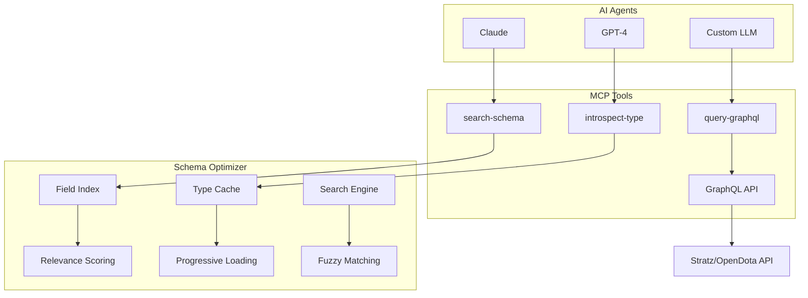

# OpenDota MCP Server

<div align="center">

[](https://opensource.org/licenses/MIT)
[](https://www.typescriptlang.org/)
[](https://graphql.org/)
[](https://bun.sh/)
[](https://www.docker.com/)

**Next-generation GraphQL MCP server that eliminates context explosion**  
*Intelligent schema discovery • Progressive introspection • Enterprise-ready*

[🇺🇸 English](README.md) • [🇷🇺 Русский](README.ru.md) • [📖 Docs](#documentation) • [🚀 Install](#installation)

[](https://smithery.ai/server/mcp-graphql)

</div>

---

## 🎯 The Problem

Traditional GraphQL MCP servers **crash AI agents** with context explosion:

```diff
- Full schema introspection → 50KB+ context → Agent crash
- Brittle hardcoded operations → Limited flexibility  
- Poor performance → 5-10s initialization times
- No intelligent discovery → Manual field hunting
```

## ✨ Our Solution

**Search + Introspect + Execute** pattern with intelligent optimization:

```diff
+ Smart field search → 2-5KB context → Stable operation
+ Progressive type loading → Flexible exploration
+ In-memory caching → <1s response times  
+ AI-friendly discovery → Automated field matching
```

<div align="center">

### **Performance Gains**

| Metric | Before | After | Improvement |
|--------|--------|-------|-------------|
| **Context Size** | 50KB+ | 2-5KB | **90% smaller** |
| **Init Time** | 5-10s | <1s | **10x faster** |
| **Schema Crashes** | Frequent | **Never** | **100% reliable** |
| **API Calls** | Every request | Cached | **5x fewer** |

</div>

---

## Quick Start

<table>
<tr>
<td width="50%">

### **Docker (Recommended)**
```bash
git clone [repo-url]
cd OpenDotaMCP

docker build -t opendota-mcp .
docker run -p 3001:3001 \
  -e ENDPOINT=https://api.stratz.com/graphql \
  -e HEADERS='{"Authorization":"Bearer TOKEN"}' \
  opendota-mcp
```

</td>
<td width="50%">

### **Local Development**
```bash
# Install & configure
bun install
echo 'ENDPOINT=https://api.stratz.com/graphql' > .env

# Development mode
bun run dev

# Test with MCP Inspector
npx mcp-inspector http://localhost:3001/mcp
```

</td>
</tr>
</table>

---

## Smart Tools

### **search-schema** → *Intelligent Field Discovery*

Find relevant GraphQL fields without context explosion:

```typescript
interface SearchParams {
  keywords: string[]      // Search terms
  maxResults?: number     // Limit results (default: 10)
}
```

<details>
<summary><b> Usage Examples</b></summary>

```javascript
// Find player-related fields
search-schema(keywords: ["player", "steam", "profile"])
// → Returns: player, steamAccount, playerProfile with relevance scores

// Discover match data
search-schema(keywords: ["match", "duration", "winner"]) 
// → Returns: match, matchStats, durationSeconds with query templates
```

</details>

### **introspect-type** → *Progressive Type Loading*

Get specific type definitions with controlled depth:

```typescript
interface IntrospectParams {
  typeName: string        // GraphQL type name
  maxDepth?: number       // Nesting depth (default: 2)
}
```

<details>
<summary><b> Usage Examples</b></summary>

```javascript
// Explore player structure
introspect-type(typeName: "PlayerType", maxDepth: 2)
// → Returns detailed PlayerType with 2 levels of nesting

// Quick match overview  
introspect-type(typeName: "MatchType", maxDepth: 1)
// → Returns MatchType with minimal nesting
```

</details>

### **query-graphql** → *Optimized Query Execution*

Execute GraphQL queries with enhanced error handling:

```typescript
interface QueryParams {
  query: string           // GraphQL query
  variables?: string      // JSON variables
}
```

---

## ⚙️ Configuration

<table>
<tr>
<td width="50%">

### **Environment Variables**

| Variable | Description | Default |
|----------|-------------|---------|
| `ENDPOINT` | GraphQL API URL | `https://api.stratz.com/graphql` |
| `HEADERS` | Request headers (JSON) | `{}` |
| `ALLOW_MUTATIONS` | Enable mutations | `false` |
| `PORT` | Server port | `3001` |
| `HOST` | Server host | `0.0.0.0` |

</td>
<td width="50%">

### **Security Features**

- ✅ **Mutations disabled** by default
- ✅ **Depth limiting** prevents recursion attacks  
- ✅ **Field filtering** minimizes data exposure
- ✅ **Input validation** with detailed errors
- ✅ **Stateless operation** - no session persistence

</td>
</tr>
</table>

---

## Architecture



---

## Real-World Examples

<details>
<summary><b> Discovering Dota 2 Player Data</b></summary>

```javascript
// 1. Search for player-related fields
search-schema(keywords: ["player", "steam", "account"])

// 2. Explore player structure  
introspect-type(typeName: "PlayerType", maxDepth: 2)

// 3. Query player information
query-graphql(query: `
  query GetPlayer($steamId: Long!) {
    player(steamAccountId: $steamId) {
      steamAccount { 
        name 
        avatar 
        profileUri 
      }
      matchCount
      winCount
      heroesPerformance(take: 5) {
        hero { displayName }
        matchCount
        winCount
      }
    }
  }
`, variables: '{"steamId": "123456789"}')
```

</details>

<details>
<summary><b> Analyzing Match Statistics</b></summary>

```javascript
// 1. Find match-related fields
search-schema(keywords: ["match", "duration", "radiant", "dire"])

// 2. Get match type details
introspect-type(typeName: "MatchType", maxDepth: 3)

// 3. Fetch detailed match data
query-graphql(query: `
  query GetMatchDetails($matchId: Long!) {
    match(id: $matchId) {
      durationSeconds
      didRadiantWin
      gameMode
      players {
        steamAccount { name }
        hero { displayName }
        kills
        deaths
        assists
        networth
        level
      }
      pickBans {
        heroId
        order
        bannedHeroId
      }
    }
  }
`, variables: '{"matchId": "7891234567"}')
```

</details>

---

##  Documentation

| Resource | Description |
|----------|-------------|
| [ **API Reference**](docs/api.md) | Complete tool documentation |
| [ **Architecture Guide**](docs/architecture.md) | Technical deep-dive |
| [ **Deployment Guide**](docs/deployment.md) | Production setup |
| [ **Troubleshooting**](docs/troubleshooting.md) | Common issues & solutions |

---

##  Contributing

We welcome contributions! Here's how to get started:

<table>
<tr>
<td width="50%">

###  **Development Setup**
```bash
# Clone and setup
git clone [repo-url]
cd OpenDotaMCP
bun install

# Create feature branch
git checkout -b feature/amazing-feature

# Start development
bun run dev
```

</td>
<td width="50%">

###  **PR Checklist**
- [ ] Tests pass (`bun test`)
- [ ] Linting passes (`bun run lint`) 
- [ ] TypeScript compiles (`bun run build`)
- [ ] Documentation updated
- [ ] Changelog entry added

</td>
</tr>
</table>

---

##  License

MIT License - see [LICENSE](LICENSE) for details.

---

##  Ecosystem

<div align="center">

| Resource | Description |
|----------|-------------|
| [**Model Context Protocol**](https://modelcontextprotocol.io/) | MCP specification |
| [**Stratz API**](https://stratz.com/api) | Dota 2 GraphQL API |
| [**OpenDota API**](https://docs.opendota.com/) | Alternative Dota 2 API |
| [**MCP Inspector**](https://github.com/modelcontextprotocol/inspector) | Debug tool |

</div>

---

<div align="center">

**Built with  for the AI & Gaming community**

[ **Star us**](https://github.com/yourusername/OpenDotaMCP/stargazers) • [🐛 **Report Bug**](https://github.com/yourusername/OpenDotaMCP/issues) • [ **Request Feature**](https://github.com/yourusername/OpenDotaMCP/discussions)

**Made possible by:** [Anthropic](https://anthropic.com) • [Bun](https://bun.sh) • [GraphQL](https://graphql.org) • [TypeScript](https://typescriptlang.org)

</div>
