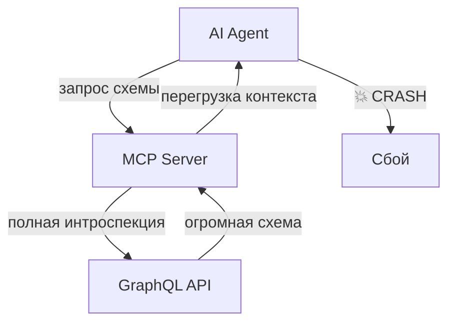
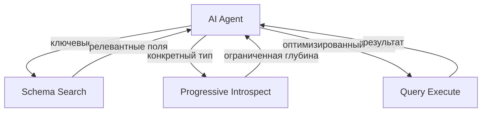
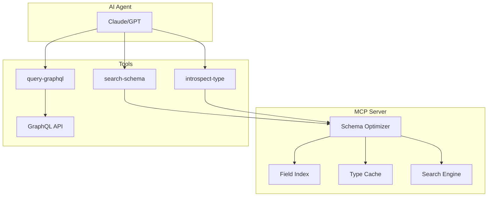

# 🚀 OpenDota MCP Server

<div align="center">

[](https://www.typescriptlang.org/)
[](https://graphql.org/)
[](https://bun.sh/)
[](https://www.docker.com/)

**Оптимизированный MCP сервер для GraphQL API с решением проблемы переполнения контекста**

[English](README.md) • **Русский** • [Документация](#документация) • [Установка](#установка)

</div>

## ✨ Особенности

<table>
<tr>
<td width="50%">

### 🧠 **Умный поиск схемы**
- **Индексация полей** с релевантностью
- **Fuzzy поиск** по именам и описаниям
- **Автогенерация** query templates
- **Контроль глубины** для предотвращения overflow

</td>
<td width="50%">

### ⚡ **Производительность**
- **In-memory кэширование** типов
- **Прогрессивная интроспекция** с depth control
- **Ленивая инициализация** схемы
- **Stateless режим** без сохранения сессий

</td>
</tr>
<tr>
<td width="50%">

### 🛡️ **Безопасность**
- **Мутации отключены** по умолчанию
- **Ограничение глубины** против атак рекурсии
- **Фильтрация полей** минимизирует утечки
- **Валидация запросов** с детальными ошибками

</td>
<td width="50%">

### 🔧 **Developer Experience**
- **Hot reload** в dev режиме
- **Docker ready** с оптимизированным образом
- **TypeScript native** с полной типизацией
- **MCP Inspector** совместимость

</td>
</tr>
</table>

## 🎯 Проблема и решение

### ❌ **Традиционные GraphQL MCP серверы**


### ✅ **Наше решение: Search + Introspect + Execute**


## 🚀 Быстрый старт

### Docker (рекомендуется)
```bash
# Клонировать репозиторий
git clone https://github.com/yourusername/OpenDotaMCP.git
cd OpenDotaMCP

# Сборка и запуск
docker build -t opendota-mcp .
docker run -p 3001:3001 \
  -e ENDPOINT=https://api.stratz.com/graphql \
  -e HEADERS='{"Authorization":"Bearer YOUR_TOKEN"}' \
  opendota-mcp
```

### Локальная разработка
```bash
# Установка зависимостей
bun install

# Конфигурация (создать .env)
echo 'ENDPOINT=https://api.stratz.com/graphql' > .env
echo 'HEADERS={"Authorization":"Bearer YOUR_TOKEN"}' >> .env

# Запуск в dev режиме
bun run dev
```

### Тестирование с MCP Inspector
```bash
# В новом терминале
npx mcp-inspector http://localhost:3001/mcp
```

## 🛠️ API инструменты

### 🔍 **search-schema**
Умный поиск полей по ключевым словам
```typescript
{
  keywords: string[],        // Ключевые слова для поиска
  maxResults?: number        // Максимум результатов (по умолчанию: 10)
}
```

**Пример использования:**
```javascript
// Поиск информации о игроках
search-schema(keywords: ["player", "steam", "profile"])

// Поиск матчей и статистики
search-schema(keywords: ["match", "duration", "winner"])
```

### 🎯 **introspect-type**
Прогрессивная интроспекция конкретных типов
```typescript
{
  typeName: string,          // Имя GraphQL типа
  maxDepth?: number          // Максимальная глубина (по умолчанию: 2)
}
```

**Пример использования:**
```javascript
// Получить структуру PlayerType
introspect-type(typeName: "PlayerType", maxDepth: 2)

// Исследовать MatchType с ограниченной глубиной
introspect-type(typeName: "MatchType", maxDepth: 1)
```

### 📊 **query-graphql**
Выполнение GraphQL запросов
```typescript
{
  query: string,             // GraphQL запрос
  variables?: string         // JSON строка с переменными
}
```

## ⚙️ Переменные окружения

| Переменная | Описание | По умолчанию |
|-----------|----------|--------------|
| `ENDPOINT` | URL GraphQL API | `https://api.stratz.com/graphql` |
| `HEADERS` | JSON заголовки для запросов | `{}` |
| `ALLOW_MUTATIONS` | Разрешить мутации | `false` |
| `NAME` | Имя MCP сервера | `mcp-graphql` |
| `PORT` | Порт HTTP сервера | `3001` |
| `HOST` | Хост для привязки | `0.0.0.0` |

## 📈 Сравнение производительности

| Метрика | Традиционный подход | Наше решение | Улучшение |
|---------|-------------------|--------------|-----------|
| **Размер контекста** | ~50KB+ | ~2-5KB | **90% меньше** |
| **Время инициализации** | 5-10с | <1с | **10x быстрее** |
| **Crashes от больших схем** | Часто | Никогда | **100% надежность** |
| **API вызовы** | При каждом запросе | Кэшированные | **5x меньше** |

## 🏗️ Архитектура



## 🧪 Примеры использования

### Исследование Dota 2 данных
```javascript
// 1. Найти поля для игроков
search-schema(keywords: ["player", "steam"])
// → Результат: player, steamAccount, playerProfile...

// 2. Изучить структуру игрока
introspect-type(typeName: "PlayerType", maxDepth: 2)
// → Получить поля и их типы

// 3. Выполнить запрос
query-graphql(query: `
  query {
    player(steamAccountId: 123456789) {
      steamAccount { name avatar }
      matchCount
      winCount
    }
  }
`)
```

### Анализ матчей
```javascript
// Поиск полей матчей
search-schema(keywords: ["match", "duration", "radiant"])

// Получить детали матча
query-graphql(query: `
  query GetMatch($matchId: Long!) {
    match(id: $matchId) {
      durationSeconds
      didRadiantWin
      players { hero { displayName } kills assists deaths }
    }
  }
`, variables: '{"matchId": "7891234567"}')
```

## 📚 Документация

- [**API Reference**](docs/api.md) - Полное описание всех инструментов
- [**Architecture Guide**](docs/architecture.md) - Техническая архитектура
- [**Deployment Guide**](docs/deployment.md) - Руководство по деплою
- [**Troubleshooting**](docs/troubleshooting.md) - Решение проблем

## 🤝 Участие в разработке

```bash
# Форк репозитория и клонирование
git clone https://github.com/yourusername/OpenDotaMCP.git

# Создание feature branch
git checkout -b feature/awesome-feature

# Внесение изменений и commit
git commit -m "feat: добавить awesome feature"

# Push и создание PR
git push origin feature/awesome-feature
```

### 📋 Чек-лист для PR
- [ ] Тесты проходят (`bun test`)
- [ ] Линтер проходит (`bun run lint`)
- [ ] TypeScript компилируется (`bun run build`)
- [ ] Документация обновлена
- [ ] Changelog обновлен

## 📄 Лицензия

MIT License - подробности в [LICENSE](LICENSE)

## 🔗 Полезные ссылки

- [**Model Context Protocol**](https://modelcontextprotocol.io/) - Спецификация MCP
- [**Stratz API**](https://stratz.com/api) - Dota 2 GraphQL API
- [**OpenDota API**](https://docs.opendota.com/) - Альтернативный Dota 2 API
- [**MCP Inspector**](https://github.com/modelcontextprotocol/inspector) - Инструмент отладки

---

<div align="center">

**Сделано с ❤️ для AI и Dota 2 сообщества**

[⭐ Поставить звезду](https://github.com/yourusername/OpenDotaMCP/stargazers) • [🐛 Сообщить о баге](https://github.com/yourusername/OpenDotaMCP/issues) • [💡 Предложить фичу](https://github.com/yourusername/OpenDotaMCP/discussions)

</div>